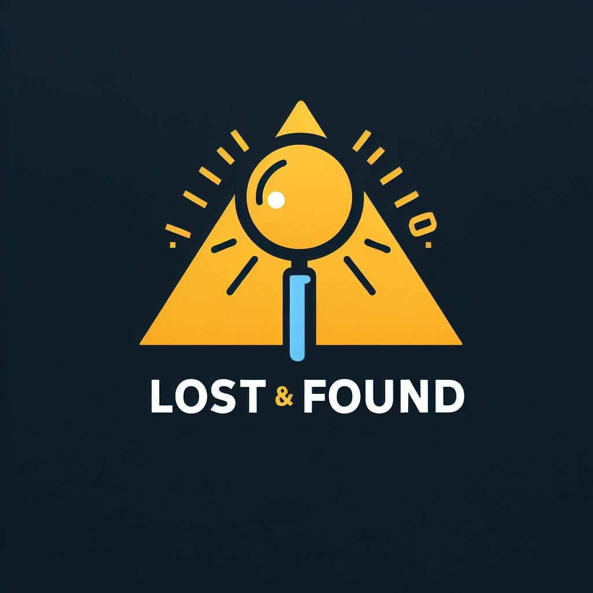
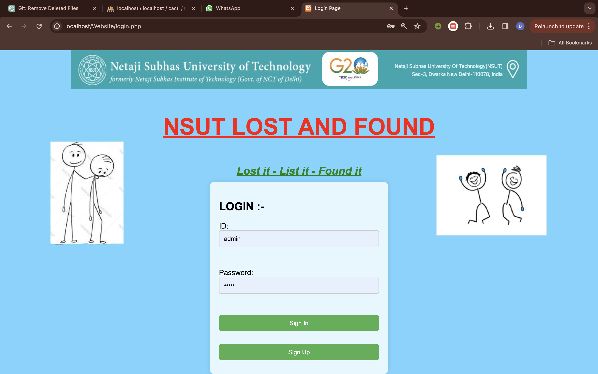
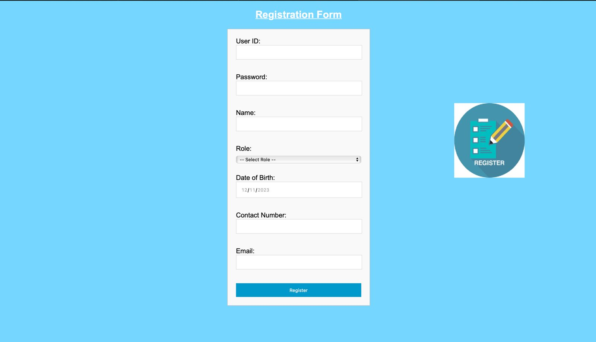
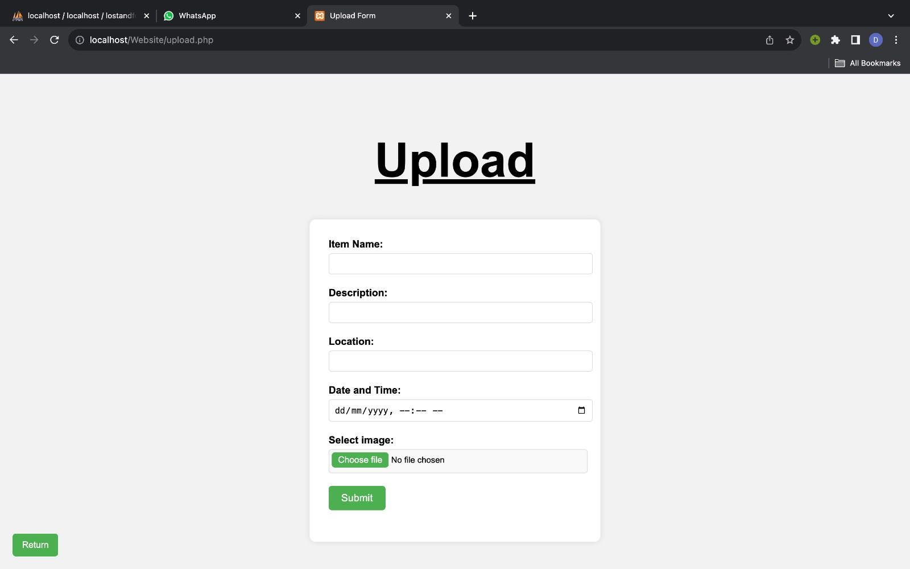
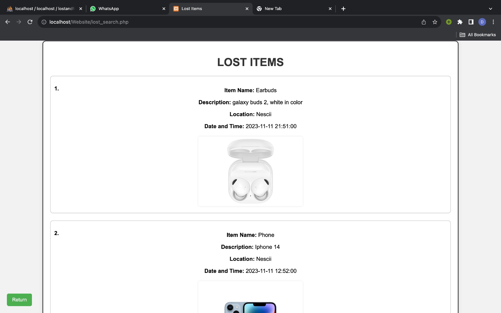
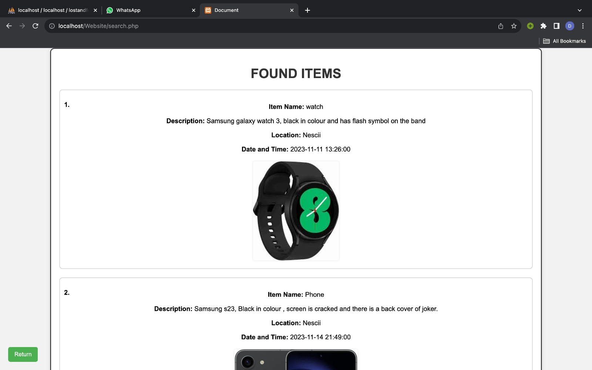
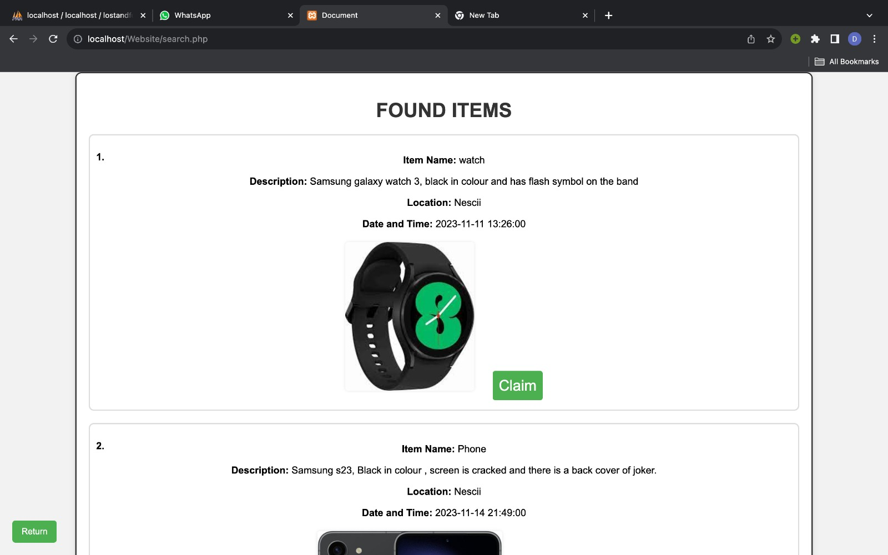
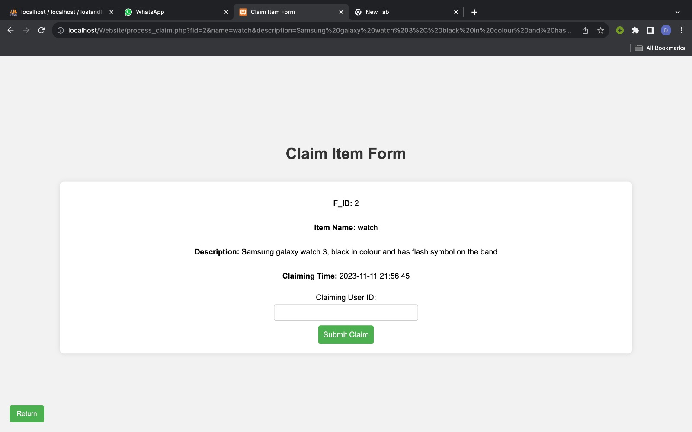
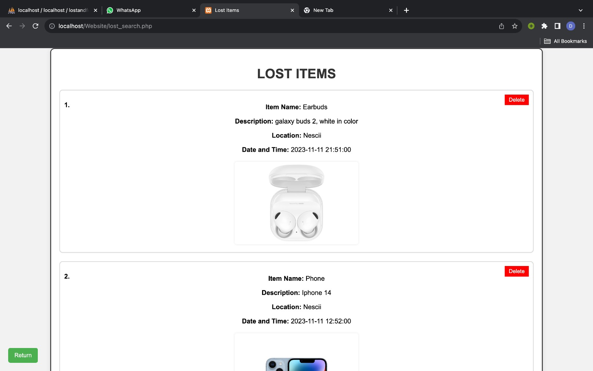
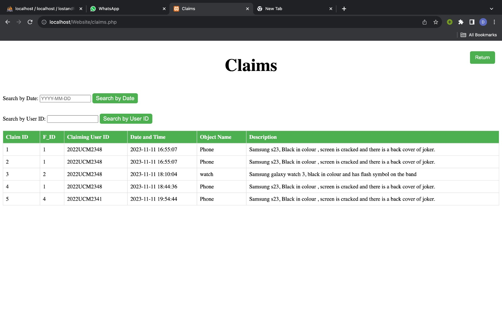

# Lost and Found System

  

## Table of Contents

- [Introduction](#introduction)
- [Features](#features)
- [Getting Started](#getting-started)
  - [Prerequisites](#prerequisites)
  - [Installation](#installation)
- [Usage](#usage)

## Introduction

The Lost and Found System is a web-based platform designed to manage lost and found items efficiently. It allows users to report lost or found items, view existing claims, and administer the system. The system helps streamline the process of matching lost items with their rightful owners.

## Features

- User authentication for secure access
- Reporting and claiming lost or found items
- Admin dashboard for managing claims and items
- Search functionality for quick retrieval of information
- Responsive and user-friendly interface

## Getting Started

### Prerequisites

Before you begin, ensure you have the following installed:

- [Web server (e.g., Apache, Nginx)](https://www.apachefriends.org/)
- [PHP](https://www.php.net/downloads.php)

### Installation

1. Clone the repository:

   ```bash
   git clone https://github.com/your-username/lost-and-found.git

#### Configure the Database:

1. Create a MySQL database called lostandfound on XAMPP.
2. Import the SQL schema from `database/schema.sql` and run it on XAMPP to create the required tables.

#### Configure Web Server:

1. Point your web server to the project's root directory (Usally htdocs).
2. Ensure that the server is configured to execute PHP files.
3. Start the web server and open the application in your browser.

## Usage

- Visit the application in your web browser.
   
   <p align="center">
     
   </p>

   
-  Register or log in to your account.

   <p align="center">
     
   </p>

   
- Report lost or found items.
   <p align="center">
     
   </p>


- View the list of items reported by others.
   <p align="center" style="display: flex; justify-content: space-between;">
   
   
</p>

  
- Administer claims through the admin dashboard.
  <p align="center" style="display: flex; justify-content: space-between;">
   
   


- Remove lost items through the admin dashboard.
   <p align="center">
     
   </p>

   
- View the record of claimed items through the admin dashboard.
   <p align="center">
     
   </p>
